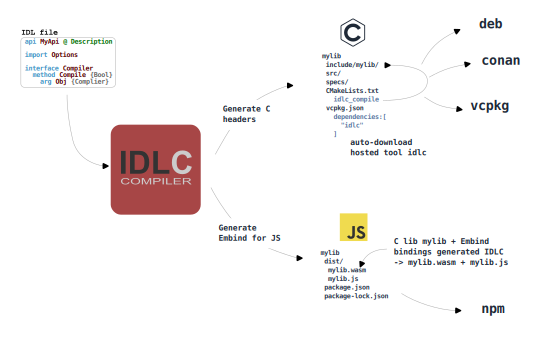

# Introduction {#introduction}

This project is not intended for production use. The tool is primarily being developed for my personal needs — to generate C APIs for C libraries from **IDL** specifications, as well as to automatically wrap the resulting C libraries for other languages, enabling them to be used as native libraries.

Below is an online demo of the compiler:

@htmlonly
<div class="custom-container">
    <textarea id="editor" class="custom-editor" placeholder="Enter your IDL code here..."></textarea>
    <button id="compileC" class="custom-button">Compile C</button>
    <button id="compileJs" class="custom-button">Compile JS</button>
    <div id="status" style="display: none;"></div>
    <div class="tabs-overview-container" id="tab-container">
    </div>
</div>

<script type="module">
    import idlc from './idlc.esm.js'

    const module = await idlc();
    
    const editor       = document.getElementById('editor');
    const compileC     = document.getElementById('compileC');
    const compileJs    = document.getElementById('compileJs');
    const tabContainer = document.getElementById('tab-container');
    const status       = document.getElementById('status');

    compileC.addEventListener('click', () => {
        compileCode(module.Generator.C);
    });

    compileJs.addEventListener('click', () => {
        compileCode(module.Generator.JAVA_SCRIPT);
    });

    function compileCode(generator) {
        const code = editor.value.trim();
        if (!code) {
            clearStatus();
            showStatus('Please enter some code to compile', 'error');
            return;
        }
        clearStatus();
        showStatus('Compiling...');

        const source = {
            name: "<input>",
            data: code
        };

        const results = {};
        const options = new module.Options;
        options.writer = function (source) {
            results[source.name] = source.data;
        };

        const compiler = new module.Compiler;
        const result = compiler.compile(generator, undefined, [source], options);

        clearStatus();
        result.messages.forEach(message => {
            showStatus(`${message.isError ? "error" : "warning"} [${message.status.value < 2000 ? "W" : "E"}${message.status.value}]: ${message.message} at ${message.filename}:${message.line}:${message.column}`, message.isError ? 'error' : 'warning')
        });

        if (result.hasErrors) {
            showStatus('Compilation failed', 'error');
        } else {
            showStatus('Compilation successful!', 'success');
        }

        result.delete();
        compiler.delete();
        options.delete();
        
        if (Object.keys(results).length !== 0) {
            showResults(results, generator);
        }
    }

    function showStatus(message, type = '') {
        const dd = document.createElement('dd');
        dd.textContent = message;

        const dl = document.createElement('dl');
        dl.appendChild(dd);
        if (type === '' || type === 'success') {
            dl.className = 'note'
        } else if (type == 'warning') {
            dl.className = 'warning'
        } else if (type == 'error') {
            dl.className = 'bug'
        }

        status.style.display = 'block';
        status.appendChild(dl);
        status.scrollTop = status.scrollHeight;
    }

    function clearStatus() {
        status.innerHTML = '';
        status.style.display = 'none';
    }

    function showResults(files, generator) {
        tabContainer.innerHTML = '';

        const tabs = document.createElement('div');
        tabs.className = `tabs-overview`;
        tabs.style = "flex-wrap: wrap";

        const tabContents = document.createElement('ul');

        const tabContentsDiv = document.createElement('div');
        tabContentsDiv.className = `tabbed`;
        tabContentsDiv.appendChild(tabContents);

        let first = true;
        const names = Object.keys(files);
        for (const [filename, content] of Object.entries(files)) {
            const b = document.createElement('b');
            b.className = `tab-title`;
            b.title = filename;
            b.textContent = filename;

            const tab = document.createElement('button');
            tab.className = `tab-button ${first ? 'active' : ''}`;
            tab.id = `tab-${filename}`;
            tab.appendChild(b);
            tab.addEventListener('click', () => switchTab(filename, names));
            tabs.appendChild(tab);

            const code = document.createElement('code');
            if (generator == module.Generator.C) {
                code.className = 'language-c';
            } else if (module.Generator.JAVA_SCRIPT) {
                code.className = 'language-cpp';
            } else {
                code.className = 'language-plaintext';
            }
            code.style.whiteSpace = 'pre';
            code.innerHTML = escapeHtml(content);

            const pre = document.createElement('pre');
            pre.appendChild(code);

            hljs.highlightElement(code);
            code.style.maxHeight = '300px';
            code.style.overflow = 'auto';
            code.style.lineHeight = '22px';

            const copyButton = DoxygenHighlight.addCopyButton(code);
            copyButton.style.right = '25px'; 

            const li = document.createElement('li');
            if (first) {
                li.className = 'selected';
            }
            li.id = `tab-content-${filename}`;
            li.appendChild(pre);
            tabContents.appendChild(li);

            first = false;
        }

        tabContainer.appendChild(tabs);
        tabContainer.appendChild(tabContentsDiv);
    }

    function switchTab(filename, files) {
        files.forEach(file => {
            document.getElementById(`tab-${file}`).classList.remove('active');
            document.getElementById(`tab-content-${file}`).classList.remove('selected');
        });
        document.getElementById(`tab-${filename}`).classList.add('active');
        document.getElementById(`tab-content-${filename}`).classList.add('selected');
    }

    function escapeHtml(unsafe) {
        return unsafe
            .replace(/&/g, "&amp;")
            .replace(/</g, "&lt;")
            .replace(/>/g, "&gt;")
            .replace(/"/g, "&quot;")
            .replace(/'/g, "&#039;");
    }

    editor.value = `@ API Sample
@ Author <author@email.org> [author]
@ MIT License [copyright]
api Sample

@ Function sample.
@ The result of multiplying {First} by {Second}. [return]
func Mul {Float32}
    arg First {Float32} @ First value
    arg Second {Float32} @ Second value

@ Vector 3.
struct Vector
    field X {Float32} @ X component
    field Y {Float32} @ Y component
    field Z {Float32} @ Z component

@ Sample object.
interface Vehicle
    prop Name [get(GetName)] @ Name of vehicle

    @ Create new vehicle instance.
    @ Vehicle instance. [return]
    @ {Destroy} [see]
    method Create {Vehicle} [ctor]
        arg Name {Str} @ Name of vehicle.

    @ Destroy vehicle instance.
    @ {Create} [see]
    method Destroy [destroy]
        arg Vehicle {Vehicle} [this] @ The 'this/self' object in OOP languages.

    @ Get name
    @ Get name of vehicle [detail]
    @ Return name of vehicle [return]
    method GetName {Str} [const]
        arg Vehicle {Vehicle} [this] @ The 'this/self' object in OOP languages.

    @ Set velocity of vehicle.
    method SetVelocity
        arg Vehicle {Vehicle} [this] @ The 'this/self' object in OOP languages.
        arg Value {Vector} [const,ref] @ Value of velocity.
`;

</script>
@endhtmlonly

For example, the **IDLC** tool itself uses its own functionality to generate its API:
- [here](https://github.com/VladimirShaleev/idlc/tree/main/specs) are the **IDL** specifications for the library;
- [here’s](https://github.com/VladimirShaleev/idlc/blob/main/CMakeLists.txt#L49-L59) the CMake target setup for generating C headers (`idlc_compile` function);
- and [here](https://github.com/VladimirShaleev/idlc/tree/main/include/idlc) are the resulting headers produced during the build.

`idlc_compile` function monitors changes in the specs (**.idl** files) and, if necessary, rebuilds the headers in the `./include/idlc` directory. These headers provide declarations for the C API, which is implemented by the C++ library. Of course, these headers are committed and distributed alongside the library.

Even for this online demo, the tool uses itself to generate the **JavaScript** library, packaging the WASM module for native use in **JavaScript** code. Exposing an API that has classes with methods, properties, and other familiar constructs.

The compiler is distributed as a library with a C API for embedding, as well as a command-line tool for standalone compilation. In other words, it can be used both as an embedded compiler and as a separate tool.

As for the **IDL** language itself — it is an abstract language not tied to any specific programming language but designed to accommodate a wide range of languages. For example, it supports properties and case-sensitive symbols, but it does not allow two different symbols that differ only in case (due to case-insensitive languages), and so on.

The workflow of this tool can be roughly represented by the following diagram:



While this project is not intended as an industrial-grade solution, it serves as a practical example of:
- building host tools as dependencies;
- integrating them into a build system.

Why a new IDL language? Traditional Interface Definition Languages (IDLs) consistently fall short in achieving true cross-language interoperability. Most of these languages ​​try to impose a "lowest common denominator" approach, which makes them awkward and unnative to use everywhere. This leads to context blindness — not adapting to linguistic idioms:
- Creates unnatural APIs across all target languages.
- Requires manual adaptation of generated code.
- Fails to respect language-specific idioms.

For example, differences in working with arrays:
- In C: typically requires (pointer, length) parameter pairs
- In Modern Languages: native array types handle bounds automatically

This language overcomes this by generating APIs and automatic wrappers for C, so that the API can be used natively in any supported language.

```
@idl
@ API Sample
api Sample

@ Sample func
func ProcessData
    arg Items {Float32} [array(Count)] @ Item values
    arg Count {Uint32} @ Number of items
```

Usage in C:

```c
@c
float items[] = { 3.2f, 4.5f, 1.2f };
sample_process_data(items, 3);
```

Usage in JavaScript:

```javascript
@javascript
// Uses native array types with built-in bounds
// function processData(items: number[]);

const items = [ 3.2, 4.5, 1.2 ];
module.processData(items);
```

For a step-by-step guide on embedding the compiler into your project (to enable API support and generate native wrappers for other languages), check out the Quick Start.

<div class="section_buttons">
 
|                            Next |
|--------------------------------:|
| [Quick Start](quick-start.html) |
 
</div>
